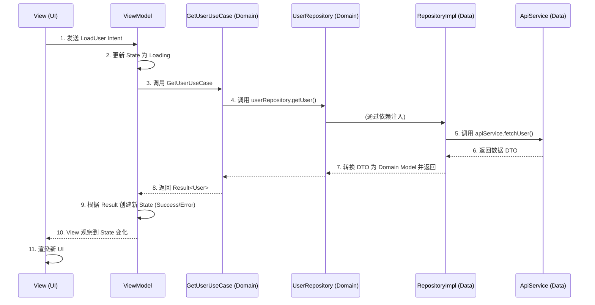

# Android架构深度解析：MVI + Clean 架构完全指南

在现代 Android 开发中，构建一个可维护、可测试且可扩展的应用至关重要。MVI (Model-View-Intent) 与 Clean 架构的结合，正是为了实现这一目标而生的黄金搭档。本文将从零开始，为你彻底讲透这套流行架构的工作原理和交互流程。

## 目录

1.  [**[Clean 架构：构建坚实的应用地基](https://github.com/CodingMan2023/codingman.github.io/issues/new#1-clean-%E6%9E%B6%E6%9E%84%E6%9E%84%E5%BB%BA%E5%9D%9A%E5%AE%9E%E7%9A%84%E5%BA%94%E7%94%A8%E5%9C%B0%E5%9F%BA)**](#1-clean-架构构建坚实的应用地基)
    *   [[分层核心思想](https://github.com/CodingMan2023/codingman.github.io/issues/new#%E5%88%86%E5%B1%82%E6%A0%B8%E5%BF%83%E6%80%9D%E6%83%B3)](#分层核心思想)
    *   [[关键解惑：为什么接口在 Domain 层，实现却在 Data 层？](https://github.com/CodingMan2023/codingman.github.io/issues/new#%E5%85%B3%E9%94%AE%E8%A7%A3%E6%83%91%E4%B8%BA%E4%BB%80%E4%B9%88%E6%8E%A5%E5%8F%A3%E5%9C%A8-domain-%E5%B1%82%E5%AE%9E%E7%8E%B0%E5%8D%B4%E5%9C%A8-data-%E5%B1%82)](#关键解惑为什么接口在-domain-层实现却在-data-层)
2.  [**[MVI 架构：打造可预测的表示层](https://github.com/CodingMan2023/codingman.github.io/issues/new#2-mvi-%E6%9E%B6%E6%9E%84%E6%89%93%E9%80%A0%E5%8F%AF%E9%A2%84%E6%B5%8B%E7%9A%84%E8%A1%A8%E7%A4%BA%E5%B1%82)**](#2-mvi-架构打造可预测的表示层)
    *   [[MVI 的三大组件](https://github.com/CodingMan2023/codingman.github.io/issues/new#mvi-%E7%9A%84%E4%B8%89%E5%A4%A7%E7%BB%84%E4%BB%B6)](#mvi-的三大组件)
    *   [[单向数据流：MVI 的魔法](https://github.com/CodingMan2023/codingman.github.io/issues/new#%E5%8D%95%E5%90%91%E6%95%B0%E6%8D%AE%E6%B5%81mvi-%E7%9A%84%E9%AD%94%E6%B3%95)](#单向数据流mvi-的魔法)
3.  [**[强强联合：MVI + Clean 架构的协作流程](https://github.com/CodingMan2023/codingman.github.io/issues/new#3-%E5%BC%BA%E5%BC%BA%E8%81%94%E5%90%88mvi--clean-%E6%9E%B6%E6%9E%84%E7%9A%84%E5%8D%8F%E4%BD%9C%E6%B5%81%E7%A8%8B)**](#3-强强联合mvi--clean-架构的协作流程)
    *   [[一次点击的完整生命周期](https://github.com/CodingMan2023/codingman.github.io/issues/new#%E4%B8%80%E6%AC%A1%E7%82%B9%E5%87%BB%E7%9A%84%E5%AE%8C%E6%95%B4%E7%94%9F%E5%91%BD%E5%91%A8%E6%9C%9F)](#一次点击的完整生命周期)
4.  [**[总结：为什么选择 MVI + Clean？](https://github.com/CodingMan2023/codingman.github.io/issues/new#4-%E6%80%BB%E7%BB%93%E4%B8%BA%E4%BB%80%E4%B9%88%E9%80%89%E6%8B%A9-mvi--clean)**](#4-总结为什么选择-mvi--clean)

---

## 1. Clean 架构：构建坚实的应用地基

Clean 架构的核心思想是 **关注点分离 (Separation of Concerns)**，它通过严格的分层来确保应用的不同部分各司其职，并遵循一个核心规则：**依赖倒置**。

### 分层核心思想

Clean 架构通常分为三层，依赖关系严格由外向内：`Presentation` -> `Domain` <- `Data`。


#### `Domain` 层 (领域层) - 应用的心脏 ❤️

这是架构的最核心层，它纯粹由 Kotlin/Java 代码构成，**不依赖任何 Android 框架**。它的职责有三：

1.  **定义业务实体 (Domain Models)**:
    这是应用的“通用语言”，例如 `User`、`Product` 等纯净的数据类。它们不应包含任何与平台或数据源相关的注解 (如 `@Entity`, `@SerializedName`)。
2.  **定义抽象规则 (Repository Interfaces)**:
    这是 Domain 层与外部世界沟通的“契约”或“合同”。例如 `UserRepository` 接口，它规定了“必须有一个获取用户的方法”，但它不关心数据究竟从何而来。
3.  **封装业务逻辑 (Use Cases / Interactors)**:
    这是应用的“大脑”，负责执行具体的业务流程，例如“用户注册”、“计算折扣”等。Use Case 会组合并调用一个或多个 Repository 接口来完成任务。

> **核心作用总结：Domain 层通过定义实体、契约和业务逻辑，构建了一个独立、稳定且可测试的应用程序核心。**

#### `Data` 层 (数据层) - 数据的来源

这一层负责实现 Domain 层定义的“契约”，并提供具体的数据。

*   **Repository 实现**: 实现 Domain 层定义的 `UserRepository` 接口，决定是从网络还是数据库获取数据。
*   **Data Sources**: 具体的 数据来源，如使用 `Retrofit` 的网络 API 服务、使用 `Room` 的本地数据库 DAO 等。

#### `Presentation` 层 (表示层) - 用户的界面

这一层负责展示 UI 并处理用户交互。它由 `View` (Activity/Fragment/Compose) 和 `ViewModel` 组成。**这也是 MVI 架构发挥作用的地方**。

### 关键解惑：为什么接口在 Domain 层，实现却在 Data 层？

这是理解 Clean 架构的钥匙！这种设计是为了实现**依赖倒置原则 (Dependency Inversion Principle)**。

*   **常规思维**: `ViewModel` -> `Repository` -> `ApiService` (高层依赖底层)
*   **依赖倒置**: `ViewModel` -> `UseCase` -> `IRepository` <- `RepositoryImpl` <- `ApiService` (高层和底层都依赖于抽象)

> **一个生动的比喻：**
> Domain 层设计了一张标准的 **“三孔插座图纸” (接口)**。Data 层负责 **“发电和布线” (实现)**，不管它是核电还是水电，最终都必须提供一个符合图纸的标准三孔插座。这样，任何电器 (Use Case) 都可以直接使用，而无需关心电是怎么来的。

这个设计的巨大优势是：

*   **解耦**: 核心业务逻辑与具体数据实现分离。更换数据库或网络库，Domain 层和 Presentation 层代码无需改动。
*   **可测试性**: 在测试 Use Case 时，可以轻松传入一个“假的” Mock Repository，实现快速、稳定的单元测试。

---

## 2. MVI 架构：打造可预测的表示层

MVI (Model-View-Intent) 是一种专注于表示层的设计模式，它的核心是**单向数据流 (Unidirectional Data Flow)**，这使得 UI 状态的管理变得极其简单和可预测。

### MVI 的三大组件

1. **Model (模型)**: 在 MVI 中，它不指单个数据对象，而是代表 **UI 的完整状态 (UI State)**。它是一个不可变 (Immutable) 的数据类，包含了渲染 UI 所需的一切信息。

   ```kotlin
   data class UserProfileState(
       val isLoading: Boolean = false,
       val user: User? = null,
       val error: String? = null
   )
   ```

2. **View (视图)**: 负责渲染 UI 和接收用户的操作。它非常“笨”，只做两件事：

   *   订阅并渲染 `State`。
   *   将用户的操作转换为 `Intent` 发送出去。

3. **Intent (意图)**: **注意**，这不是 `android.content.Intent`。它代表用户的操作意图，是一个简单的对象，例如 `LoadUserIntent`, `RefreshIntent` 等。

### 单向数据流：MVI 的魔法

MVI 强制数据在一个封闭的、可预测的循环中流动，避免了状态的混乱。


1.  **`View`** 捕捉用户操作，创建并发送一个 **`Intent`**。
2.  **`ViewModel`** 接收 `Intent`，并根据它执行相应的业务逻辑。
3.  业务逻辑完成后，`ViewModel` 创建一个**全新的 `State`**。
4.  **`View`** 订阅 `State` 的变化，当接收到新 `State` 时，用它来更新整个 UI。

这个循环确保了 UI 状态的来源永远是唯一的 (`ViewModel`)，使得调试和追踪问题变得异常简单。

---

## 3. 强强联合：MVI + Clean 架构的协作流程

现在，我们将两者结合，看看一次完整的用户交互是如何流经整个架构的。

**场景：用户点击“加载用户数据”按钮。**



### 一次点击的完整生命周期

1.  **View (UI)**: 用户点击按钮，`View` 创建一个 `LoadUserIntent` 并发送给 `ViewModel`。
2.  **ViewModel (MVI)**: 接收到 `Intent`，立即更新 `StateFlow` 的值为 `UserProfileState(isLoading = true)`，UI 马上显示加载圈。
3.  **ViewModel 调用 Domain**: `ViewModel` 调用 `GetUserUseCase` 来执行业务逻辑。
4.  **UseCase (Domain)**: `GetUserUseCase` 调用它持有的 `UserRepository` **接口**的方法。
5.  **Repository (Data)**: `UserRepositoryImpl`（通过依赖注入传入）执行具体的数据获取逻辑，比如调用 `Retrofit` 的 `ApiService`。
6.  **数据返回**: 数据从 `ApiService` -> `RepositoryImpl` (在这里将 DTO 转换为 Domain Model) -> `UseCase` -> `ViewModel`。
7.  **ViewModel 更新 State**: `ViewModel` 收到 `UseCase` 返回的 `Result` 对象。
    *   **成功**: 创建 `State(isLoading = false, user = ...)`。
    *   **失败**: 创建 `State(isLoading = false, error = "...")`。
8.  **View 渲染**: `View` 一直在监听 `StateFlow`，当接收到这个新的 `State` 对象时，它会根据其中的属性来更新 UI，显示用户信息或错误提示。

---

## 4. 总结：为什么选择 MVI + Clean？

MVI + Clean 架构的组合，为我们提供了一个分工明确、高度解耦、易于测试的开发框架。

*   **Clean 架构** 负责宏观分层，像一个国家的**宪法**，保证了**业务逻辑的独立性**和代码的长期健康。
*   **MVI** 负责微观的表示层管理，像一个高效的**新闻发言人**，通过**单向数据流**保证了 **UI 状态的可预测性和一致性**。